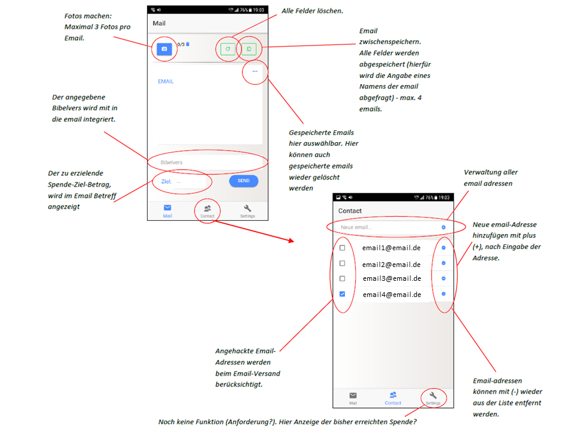

This app is written based on starter template for [Ionic] ()ionic2-starter `tabs`(http://ionicframework.com/docs/) projects.


### Description:
Diese Applikation wurde zum Sammeln von Spenden und der Verbreitung von Informationen der Beduerftigen per Email realisiert. Dabei hat der Nutzer die Moeglichkeit sowohl Fotos, als auch Text in die Spenden-Email zu integrieren. Das Managen von Email-Adressen ist ebenfalls bereits implementiert. *Die Anzeige des bereits eingenommenen Spendenbetrags ist bisher nur als Ladebalken ohne jegliche Information realisiert.* Die App kann in der bisher vorliegenden Form bereits verwendet werden!

### Install (ionic2 and cordova required):

```bash
$ npm install
```

### Start app:

```bash
$ ionic serve
```



